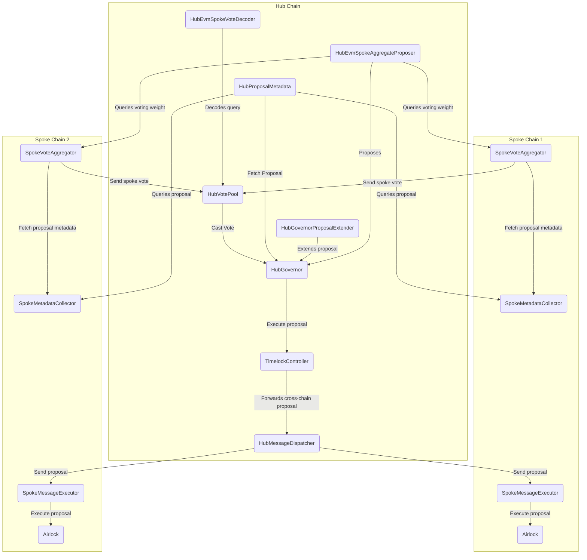

# Multi-Gov: Cross chain governance

- [About](#about)
- [Architecture](#architecture)
- [Development](#development)
- [License](#license)

## About

Multi-Gov is an extension of the OpenZeppelin Governor contracts that allows token holders to maintain their voting rights after bridging their tokens to another chain.

## Architecture

### Summary

Broadly, the system is comprised of smart contracts that live on a single hub network (e.g. Ethereum mainnet) and many spoke networks (e.g. Optimism, Arbitrum, etc.). The hub network is the center of governance, where proposals are created, voted on, and executed. But token holders on spoke networks are also able to participate in governance, by voting with their bridged governance token. These votes accumulate on a `SpokeVoteAggregator` contract, and then get relayed back to the `HubGovernor` for inclusion in the proposal vote. The MultiGov infrastructure deployed on these spoke chains is governed by the hub, and the hub can get messages to the spokes via the `HubMessageDispatcher`. Other key crosschain components are a `SpokeMetadataCollector` which retrieves Hub proposal data via query, and a `HubEvmSpokeAggregateProposer` which enables voters to use their spoke token balance (summing over one or multiple spokes) to meet proposal threshold and create a proposal.

### Component summary: Hub

#### HubGovernor

The DAO's central governance contract. It handles managing proposals and tallying votes for a given proposal.

#### HubGovernorProposalExtender

A deployed extension contract to the `HubGovernor` that is owned by the `HubGovernor`. It allows an actor trusted by Wormhole governance to extend the vote end of a proposal. This contract cannot be updated in the system without updating the `HubGovernor`.

#### HubProposalMetadata

A helper contract that returns both the proposalId and the vote start for a given proposal on the `HubGovernor`.A `SpokeMetadataCollector` will use this helper contract to query proposal data from the Hub.

#### HubVotePool

This contract receives aggregated votes from each spoke via query, and casts this vote on the` HubGovernor`. Vote query responses are expected to be submitted via crank-turn at regular intervals during the voting period.

#### HubEvmSpokeVoteDecoder

A contract that parses and decodes the data for an EVM spoke vote. The spoke vote will be registered and submitted with the "eth call with finality" query type. This is registered with the id of a specific query type on the `HubVotePool`.

#### HubMessageDispatcher

This is the contract used to relay proposal execution to a spoke or spokes. A proposal can encode a call to this contract, which in turn forwards calldata to a `SpokeMessageExecutor` on a specific spoke. The proposal will be sent to the spoke using specialized relaying and can be retried until the proposal is executed successfully.

### Component summary: Spoke

#### SpokeMetadataCollector

This contract receives proposal data from the hub's `HubProposalMetadata` via an "eth call with finality" query. The `SpokeVoteAggregator` will rely on this proposal data as it receives votes on the spoke for a given proposal.

#### SpokeVoteAggregator

A contract that allows token holders on the spoke to cast votes on proposals. These votes will be queried from the hub's `HubVotePool`. This contract should be owned by the spoke airlock.

#### SpokeMessageExecutor

This contract receives the calldata for any proposal that came from the hub down to this spoke via a specialized relayer message. This call will then get forwarded to the `SpokeAirlock` for execution.

#### SpokeAirlock

This contract can be thought of as governance's "admin" on the spoke, with important permissions and its own treasury. This is similar to how most DAOs have a "timelock" with all permissions and funds, except there's no execution queue here.

### Governance upgrade paths for key contracts

- `HubGovernor`:
  1. A new `HubGovernor` contract will need to be deployed.
  2. The admin of the timelock must be changed from the old governor to the new governor.
  3. Multi gov will need to be redeployed for the new governor.
- `HubVotePool`: A new contract must be deployed that reads the state from the old `HubVotePool` vote state at a given timestamp and then all of the spoke vote aggregators must be registered on the new hub vote pool.
- `SpokeVoteAggregator`: A new spoke vote aggregator will need to be deployed which must be able to read the vote totals for any active proposals at the timestamp of the new deploy. The new spoke vote aggregator must be registered on the `HubVotePool`.
- `SpokeMessageExecutor`: Deploy a new contract and then update the hub dispatcher to call the new spoke message executor.

### Diagram

This diagram represents the architecture of the current implementation.

## Development

### EVM

#### Getting Started

This repo is built using [Foundry](https://github.com/foundry-rs/foundry).

1. [Install Foundry](https://github.com/foundry-rs/foundry)
2. Install dependencies with `make install-evm`

#### Development

- Copy the evm/env.sample file to evm/.env and replace the RPC_URLs with your own endpoints.
- Build contracts with `make build-evm`.
- Run tests with `make test-evm`.

#### Deployment

For information regarding scripts to accomplish contract deployment, see the evm/scripts folder and the [scripts section of the foundry book](https://book.getfoundry.sh/reference/forge/forge-script).

## License

This repo is licensed under the [Apache 2 license](./LICENSE).
