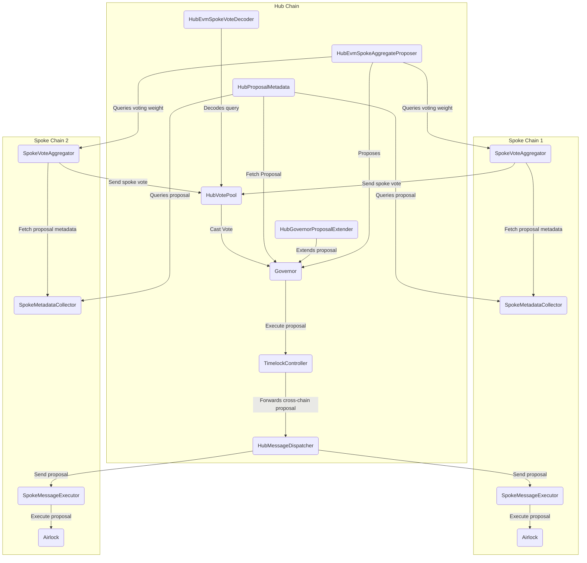

# Multi-Gov: Cross chain governance

- [About](#about)
- [Architecture](#architecture)
- [Development](#development)
- [License](#license)

## About

Multi-Gov is an extension of the OpenZeppelin Governor contracts that allows token holders to maintain their voting rights after bridging their tokens to another chain.

## Overview

This template is designed to be a simple but powerful configuration for Foundry projects, that aims to help you follow Solidity and Foundry [best practices](https://book.getfoundry.sh/tutorials/best-practices)
Writing secure contracts is hard, so it ships with strict defaults that you can loosen as needed.

## Architecture

This diagram represents the architecture of the current implementation.



### Component summary

#### Hub contracts

- HubGovernor: The DAO's governance contract. It handles managing proposals and tallying votes for a given proposal. 
- HubGovernorProposalExtender: A contract that is immutably set on the `HubGovernor` and is owned by the `HubGovernor`. It allows a trusted actor to extend the vote end of a proposal. This contract cannot be updated in the system without updating the `HubGovernor`
- HubProposalMetadata: A contract that returns both the proposalId and the vote start for a given proposal on the `HubGovernor`.
- HubVotePool: A contract that is owned by the `HubGovernor`, and submits aggregated votes from each Spoke. Submitted votes will be atomic and are submitted at a regular interval during the voting period.
- HubEvmSpokeVoteDecoder: A contract that parses and decodes the data for a spoke vote. The spoke vote will be registered and submitted with the eth call with finality query type. This registered with the id of a specific query type on the `HubVotePool`.
- HubMessageDispatcher: A contract that can be called in a proposal and will forward a proposal to be executed on a specific spoke. The proposal will be sent to the spoke using specialized relaying and can be submitted until the proposal is executed successfully because of this we recommend calling functions on the spoke that have some nonce or expiry.

#### Spoke Contracts
- SpokeMetadataCollector: A contract that receives an eth call with fianlity query from the Hub that contains a call that returns the proposalId and vote start. 
- SpokeVoteAggregator:: A contract that allows token holders on the spoke to cast votes that will be sent to the Hub. This contract should be owned by the spoke airlock.
_ SpokeMessageExecutor: A contract that receives a specialized relayer message to execute a proposal on the spoke. Proposals are called by the spoke airlock within the spoke messsage executor.
- SpokeAirlock: A contract that handles executing proposals on the spoke and can be thought of as an governance account that lives on the Spoke similar to the timelock on the Hub.

### Governance upgrade paths for key contracts


- HubGovernor: First a new Governor contract will need to be deployed, the admin of the timelock needs to be changed from the old governor to the new governor, and multi gov will need to be redeployed for the new governor.
- HubVotePool: A new contract must be deployed that reads the state from the old hubVotePool vote state at a given timestamp and then all of the spoke vote aggregators must be registered on the new hub vote pool.
- SpokeVoteAggregator: A new spoke vote aggregator will need to be deployed which must be able to read the vote totals for any active proposals at the timestamp of the new deploy. The new spoke vote aggregator must be registered on the `HubVotePool`.

### `foundry.toml`

The `foundry.toml` config file comes with:

- A `fmt` configuration.
- `default`, `lite`, and `ci` profiles.

Both of these can of course be modified.
The `default` and `ci` profiles use the same solc build settings, which are intended to be the production settings, but the `ci` profile is configured to run deeper fuzz and invariant tests.
The `lite` profile turns the optimizer off, which is useful for speeding up compilation times during development.

It's recommended to keep the solidity configuration of the `default` and `ci` profiles in sync, to avoid accidentally deploying contracts with suboptimal configuration settings when running `forge script`.
This means you can change the solc settings in the `default` profile and the `lite` profile, but never for the `ci` profile.

Note that the `foundry.toml` file is formatted using [Taplo](https://taplo.tamasfe.dev/) via `scopelint fmt`.

### CI

Robust CI is also included, with a GitHub Actions workflow that does the following:

- Runs tests with the `ci` profile.
- Verifies contracts are within the [size limit](https://eips.ethereum.org/EIPS/eip-170) of 24576 bytes.
- Runs `forge coverage` and verifies a minimum coverage threshold is met.
- Runs `slither`, integrated with GitHub's [code scanning](https://docs.github.com/en/code-security/code-scanning). See the [Configuration](#configuration) section to learn more.

The CI also runs [scopelint](https://github.com/ScopeLift/scopelint) to verify formatting and best practices:

- Checks that Solidity and TOML files have been formatted.
  - Solidity checks use the `foundry.toml` config.
  - Currently the TOML formatting cannot be customized.
- Validates test names follow a convention of `test(Fork)?(Fuzz)?_(Revert(If_|When_){1})?\w{1,}`. [^naming-convention]
- Validates constants and immutables are in `ALL_CAPS`.
- Validates internal functions in `src/` start with a leading underscore.
- Validates function names and visibility in forge scripts to 1 public `run` method per script. [^script-abi]

Note that the foundry-toolchain GitHub Action will cache RPC responses in CI by default, and it will also update the cache when you update your fork tests.

### Test Structure

The test structure is configured to follow recommended [best practices](https://book.getfoundry.sh/tutorials/best-practices).
It's strongly recommended to read that document, as it covers a range of aspects.
Consequently, the test structure is as follows:

- The core protocol deploy script is `script/Deploy.sol`.
  This deploys the contracts and saves their addresses to storage variables.
- The tests inherit from this deploy script and execute `Deploy.run()` in their `setUp` method.
  This has the effect of running all tests against your deploy script, giving confidence that your deploy script is correct.
- Each test contract serves as `describe` block to unit test a function, e.g. `contract Increment` to test the `increment` function.

## Configuration

After creating a new repository from this template, make sure to set any desired [branch protections](https://docs.github.com/en/repositories/configuring-branches-and-merges-in-your-repository/defining-the-mergeability-of-pull-requests/about-protected-branches) on your repo.

### Coverage

The [`ci.yml`](.github/workflows/ci.yml) has `coverage` configured by default, and contains comments explaining how to modify the configuration.
It uses:
The [lcov] CLI tool to filter out the `test/` and `script/` folders from the coverage report.

- The [romeovs/lcov-reporter-action](https://github.com/romeovs/lcov-reporter-action) action to post a detailed coverage report to the PR. Subsequent commits on the same branch will automatically delete stale coverage comments and post new ones.
- The [zgosalvez/github-actions-report-lcov](https://github.com/zgosalvez/github-actions-report-lcov) action to fail coverage if a minimum coverage threshold is not met.

Be aware of foundry's current coverage limitations:

- You cannot filter files/folders from `forge` directly, so `lcov` is used to do this.
- `forge coverage` always runs with the optimizer off and without via-ir, so if you need either of these to compile you will not be able to run coverage.

Remember not to optimize for coverage, but to optimize for [well thought-out tests](https://book.getfoundry.sh/tutorials/best-practices?highlight=coverage#best-practices-1).

### Slither

In [`ci.yml`](.github/workflows/ci.yml), you'll notice Slither is configured as follows:

```yml
slither-args: --filter-paths "./lib|./test" --exclude naming-convention,solc-version
```

This means Slither is not run on the `lib` or `test` folders, and the [`naming-convention`](https://github.com/crytic/slither/wiki/Detector-Documentation#conformance-to-solidity-naming-conventions) and [solc-version](https://github.com/crytic/slither/wiki/Detector-Documentation#incorrect-versions-of-solidity) checks are disabled.

This `slither-args` field is where you can change the Slither configuration for your project, and the defaults above can of course be changed.

Notice that Slither will run against `script/` by default.
Carefully written and tested scripts are key to ensuring complex deployment and scripting pipelines execute as planned, but you are free to disable Slither checks on the scripts folder if it feels like overkill for your use case.

For more information on configuration Slither, see [the documentation](https://github.com/crytic/slither/wiki/Usage). For more information on configuring the slither action, see the [slither-action](https://github.com/crytic/slither-action) repo.

### GitHub Code Scanning

As mentioned, the Slither CI step is integrated with GitHub's [code scanning](https://docs.github.com/en/code-security/code-scanning) feature.
This means when your jobs execute, you'll see two related checks:

1. `CI / slither-analyze`
2. `Code scanning results / Slither`

The first check is the actual Slither analysis.
You'll notice in the [`ci.yml`](.github/workflows/ci.yml) file that this check has a configuration of `fail-on: none`.
This means this step will _never_ fail CI, no matter how many findings there are or what their severity is.
Instead, this check outputs the findings to a SARIF file[^sarif] to be used in the next check.

The second check is the GitHub code scanning check.
The `slither-analyze` job uploads the SARIF report to GitHub, which is then analyzed by GitHub's code scanning feature in this step.
This is the check that will fail CI if there are Slither findings.

By default when you create a repository, only alerts with the severity level of `Error` will cause a pull request check failure, and checks will succeed with alerts of lower severities.
However, you can [configure](https://docs.github.com/en/code-security/code-scanning/automatically-scanning-your-code-for-vulnerabilities-and-errors/configuring-code-scanning#defining-the-severities-causing-pull-request-check-failure) which level of slither results cause PR check failures.

It's recommended to conservatively set the failure level to `Any` to start, and to reduce the failure level if you are unable to sufficiently tune Slither or find it to be too noisy.

Findings are shown directly on the PR, as well as in your repo's "Security" tab, under the "Code scanning" section.
Alerts that are dismissed are remembered by GitHub, and will not be shown again on future PRs.

Note that code scanning integration [only works](https://docs.github.com/en/code-security/code-scanning/automatically-scanning-your-code-for-vulnerabilities-and-errors/setting-up-code-scanning-for-a-repository) for public repos, or private repos with GitHub Enterprise Cloud and a license for GitHub Advanced Security.
If you have a private repo and don't want to purchase a license, the best option is probably to:

- Remove the `Upload SARIF file` step from CI.
- Change the `Run Slither` step to `fail-on` whichever level you like, and remove the `sarif` output.
- Use [triage mode](https://github.com/crytic/slither/wiki/Usage#triage-mode) locally and commit the resulting `slither.db.json` file, and make sure CI has access to that file.

[^naming-convention]:
    A rigorous test naming convention is important for ensuring that tests are easy to understand and maintain, while also making filtering much easier.
    For example, one benefit is filtering out all reverting tests when generating gas reports.

[^script-abi]: Limiting scripts to a single public method makes it easier to understand a script's purpose, and facilitates composability of simple, atomic scripts.
[^sarif]:
    [SARIF](https://sarifweb.azurewebsites.net/) (Static Analysis Results Interchange Format) is an industry standard for static analysis results.
    You can read learn more about SARIF [here](https://github.com/microsoft/sarif-tutorials) and read about GitHub's SARIF support [here](https://docs.github.com/en/code-security/code-scanning/integrating-with-code-scanning/sarif-support-for-code-scanning).
