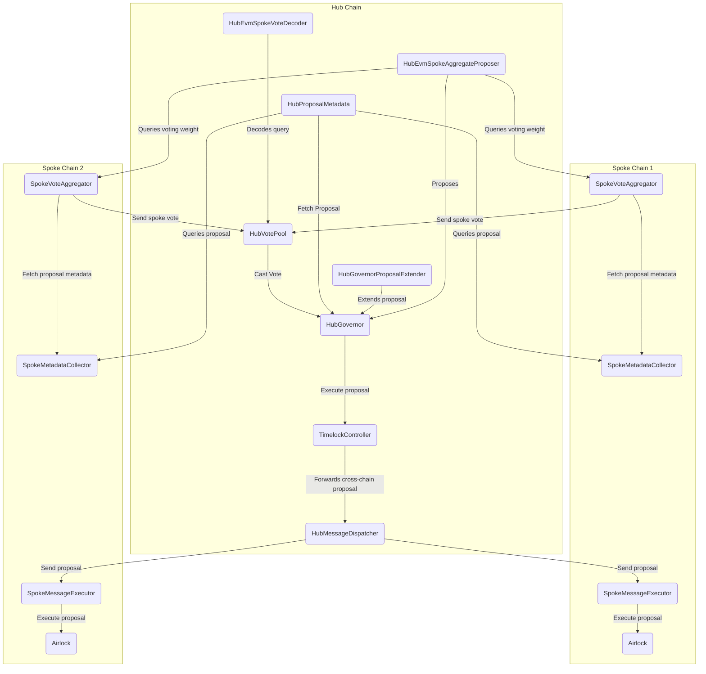

# Multi-Gov: Cross chain governance

- [About](#about)
- [Architecture](#architecture)
- [Development](#development)
- [License](#license)

## About

Multi-Gov is an extension of the OpenZeppelin Governor contracts that allows token holders to maintain their voting rights after bridging their tokens to another chain.

## Architecture

### Component summary

#### Hub

- HubGovernor: The DAO's governance contract. It handles managing proposals and tallying votes for a given proposal.
- HubGovernorProposalExtender: A contract that is immutably set on the `HubGovernor` and is owned by the `HubGovernor`. It allows a trusted actor to extend the vote end of a proposal. This contract cannot be updated in the system without updating the `HubGovernor`
- HubProposalMetadata: A contract that returns both the proposalId and the vote start for a given proposal on the `HubGovernor`.
- HubVotePool: A contract that is owned by the `HubGovernor`, and submits aggregated votes from each Spoke. Submitted votes will be atomic and are submitted at a regular interval during the voting period.
- HubEvmSpokeVoteDecoder: A contract that parses and decodes the data for a spoke vote. The spoke vote will be registered and submitted with the eth call with finality query type. This registered with the id of a specific query type on the `HubVotePool`.
- HubMessageDispatcher: A contract that can be called in a proposal and will forward a proposal to be executed on a specific spoke. The proposal will be sent to the spoke using specialized relaying and can be submitted until the proposal is executed successfully because of this we recommend calling functions on the spoke that have some nonce or expiry.

#### Spoke

- SpokeMetadataCollector: A contract that receives an eth call with fianlity query from the Hub that contains a call that returns the proposalId and vote start.
- SpokeVoteAggregator:: A contract that allows token holders on the spoke to cast votes that will be sent to the Hub. This contract should be owned by the spoke airlock.
  \_ SpokeMessageExecutor: A contract that receives a specialized relayer message to execute a proposal on the spoke. Proposals are called by the spoke airlock within the spoke messsage executor.
- SpokeAirlock: A contract that handles executing proposals on the spoke and can be thought of as an governance account that lives on the Spoke similar to the timelock on the Hub.

### Governance upgrade paths for key contracts

- HubGovernor: First a new Governor contract will need to be deployed, the admin of the timelock needs to be changed from the old governor to the new governor, and multi gov will need to be redeployed for the new governor.
- HubVotePool: A new contract must be deployed that reads the state from the old hubVotePool vote state at a given timestamp and then all of the spoke vote aggregators must be registered on the new hub vote pool.
- SpokeVoteAggregator: A new spoke vote aggregator will need to be deployed which must be able to read the vote totals for any active proposals at the timestamp of the new deploy. The new spoke vote aggregator must be registered on the `HubVotePool`.
- SpokeMessageExecutor: Deploy a new contract and then update the hub dispatcher to call the new spoke message executor.

### Diagram

This diagram represents the architecture of the current implementation.

## Development

### EVM

#### Getting Started

This repo is built using [Foundry](https://github.com/foundry-rs/foundry).

1. [Install Foundry](https://github.com/foundry-rs/foundry)
2. Install dependencies with `make install-evm`

#### Development

- Copy the evm/env.sample file to evm/.env and replace the RPC_URLs with your own endpoints.
- Build contracts with `make build-evm`.
- Run tests with `make test-evm`.

#### Deployment

For information regarding scripts to accomplish contract deployment, see the evm/scripts folder and the [scripts section of the foundry book](https://book.getfoundry.sh/reference/forge/forge-script).

## License

This repo is licensed under the [Apache 2 license](./LICENSE).
